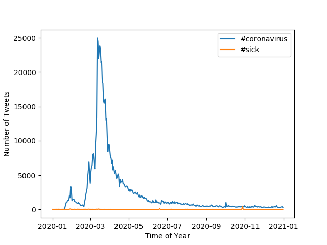

# Coronavirus Twitter Analysis

For this project, I scanned all geotagged tweets sent during 2020 to monitor for
the spread of COVID-19 on social media. About 500 million tweets are sent everyday with roughly 2% of them being *geotagged*. 


**In doing this project, I:**

1. worked with large scale datasets
1. worked with multilingual text
1. used the MapReduce divide-and-conquer paradigm to create parallel code

## What was used?

**Here are the following files, commands, and scripts used in this project:**

`map.py` file processes the zip file for an individual day. Essentially it extracts hashtag usage info for languages and countries.

`reduce.py` file merges the outputs created by the `map.py` file so that the combined files can be visualized easier.

`visualize.py` file displays the output from running the `map.py`

`run_maps.sh` script loops over each file in the dataset and runs `map.py` on them.

`alternative_reduce.py` file, similar to a combined version of the `reduce.py` and `visualize.py` files, scans through all of the data in the `outputs` folder created by the mapping process.


#Simplifying the Data
I went through the MapReduce procedure to examine the tweets. I created files that inspect daily tweets and made discrete files that follow the usage of the hashtags (both language and country). Following that, I concatenated all of the data in the files into two files, `reduced.lang` and `reduced.country`.

```
$ ./src/reduce.py --input_paths outputs/geoTwitter*.lang --output_path=reduced.lang
```

```
$ ./src/reduce.py --input_paths outputs/geoTwitter*.country --output_path=reduced.country
```

#Visual of the Data

I then visualized the utilization of both `#coronavirus`and `#코로나바이러스` by language and country. In order to keep in clean, I used just the top 10 languages and countries that used both of these hashtags. 

```
$ ./src/visualize.py --input_path=reduced.lang --key='#coronavirus'
```

```
$ ./src/visualize.py --input_path=reduced.country --key='#coronavirus'
```

```
$ ./src/visualize.py --input_path=reduced.lang_1 --key='#코로나바이러스'
```

```
$ ./src/visualize.py --input_path=reduced.country_1 --key='#코로나바이러스'
```

These four lines of code above lead to the four graphs displayed under:

## Language Rate of Occurence for #coronavirus

.png)

## Country Rate of Occurrence for #coronavirus

.png)

## Language Rate of Occurrence for #코로나바이러스

.png)

## Country Rate of Occurrence for #코로나바이러스

.png)

# Time Series Data for Number of Tweets

Finally I created a script that can choose any number of hashtags and record its usage every single day of 2020.

```
$./alternative_reduce.py --key '#coronavirus' '#sick'
```

##Number of Tweets using these hashtags


